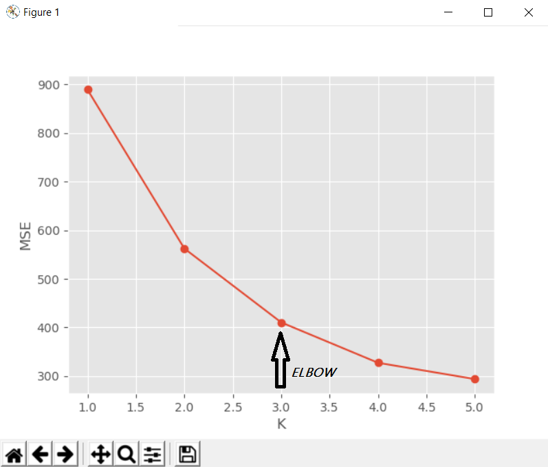
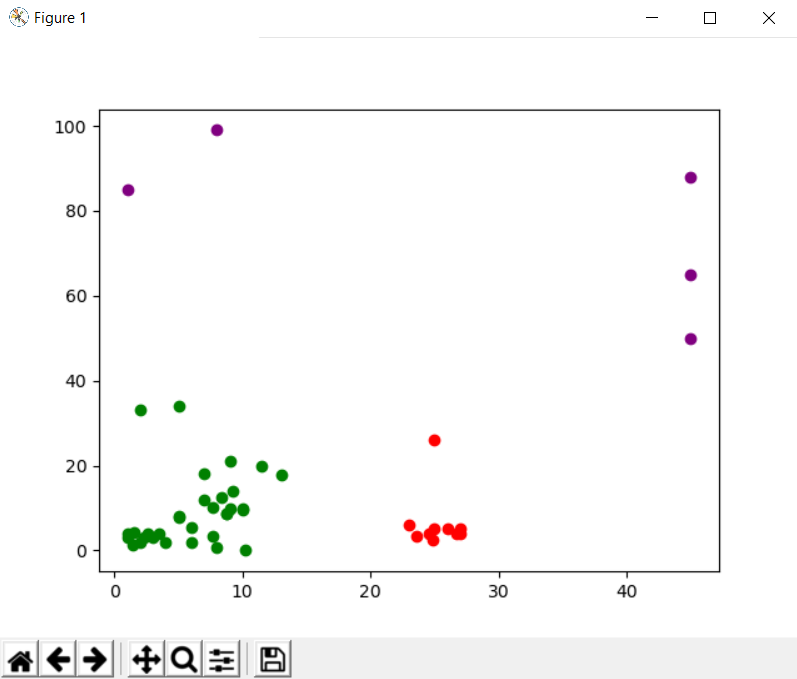

# K-Means-Clustering-Implementation

How it works-

Using dendograms or other method first we determine the optimal number of clusters. We initialize the a number of points which are randomly present on the plot.
Now we group the points to the randomly points according to the random point which is a the nearest to the point. Now we have clusters to start with.
Now we calculate the new centroids of the clusters. Now according to the new centroids we make new clusters based on the same idea as we used before of nearest distance.
After this we calculate the new centroids and repeat the making of clusters and centroids , till when none of the clusters receives a new point. At this point the clusters are ready. 

Elbow point is the point after which there is more sharp decrease in error . So this point is the optimal number of clusters.

